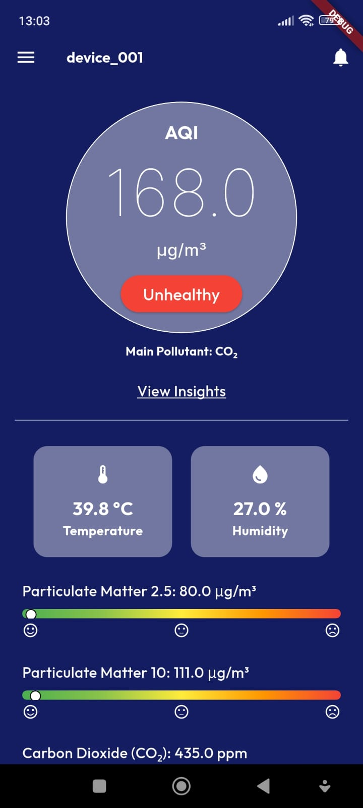
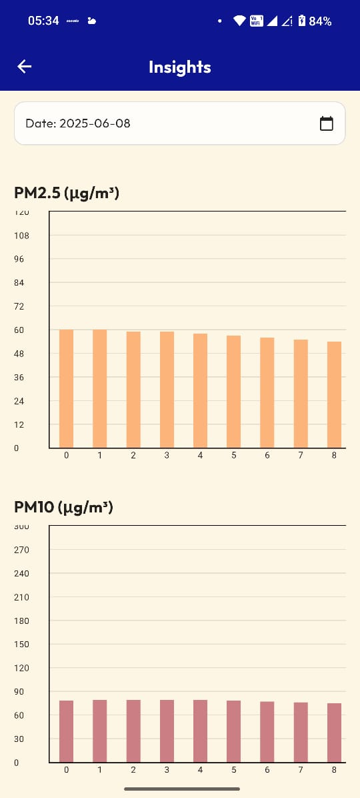

# CAQMIEAS – Flutter Air Quality Monitoring App

**Centralized Air Quality Monitoring IoT-enabled Environmental Assessment System**

CAQMIEAS is an Android application built in **Flutter** that provides **real-time air quality data** from an IoT-based sensor system. It visualizes live and historical data for pollutants like **PM2.5**, **PM10**, and **CO₂**, helping users understand their environment and act accordingly.

>  Built as part of an environmental awareness and IoT monitoring initiative.

---

## Features

-  **Live Monitoring via WebSocket**  
  Receives real-time data from the CAQMIEAS IoT device.

-  **Graphical Insights**  
  View daily AQI, PM2.5, and PM10 trends with interactive charts.

-  **Export as PDF**  
  Download graphs and insights for reporting or offline use.

-  **Calendar-based Filters**  
  Select specific dates to view pollutant data by the hour.

-  **Firebase Firestore Integration**  
  Stores and fetches structured historical sensor data.

-  **Air Quality Level Indicators**  
  Status meters color-code pollution levels (e.g., “Unhealthy”, “Good”).

---

##  Tech Stack

| Category       | Technologies Used |
|----------------|-------------------|
| **Framework**  | Flutter |
| **Database**   | Firebase Firestore |
| **Real-time**  | socket_io_client |
| **State Mgmt** | Provider |
| **Graphing**   | fl_chart |
| **PDF Export** | pdf, printing |
| **UI**         | google_fonts, flutter_svg |
| **Other**      | intl, http, url_launcher |

---

##  Screenshots

###  Live Dashboard


###  Insights Page (Graph View)


---

##  Getting Started

>  App is not yet published on Play Store.  
>  To try it out, contact the developer to get the latest APK file.

### Installation Steps (for developers)

```bash
git clone https://github.com/navyatiwari11/caqmieas.git
cd caqmieas
flutter pub get
flutter run
